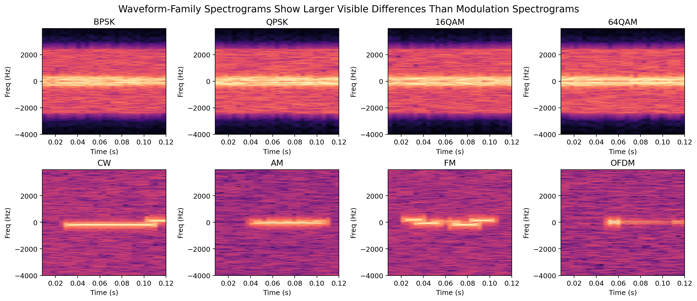

# Datasets

This document is the canonical dataset catalog for the cleaned experiment suite in this repo.

It covers:

- owned datasets created in this project
- local derived datasets created from those sources
- external datasets that were downloaded and then adapted for experiments here

## Dataset Families

The main datasets used by the current experiment suite are:

1. synthetic modulation-family dataset
2. synthetic waveform-family dataset
3. captured RTL-SDR dataset
4. Sub-GHz protocol dataset and its derived HDF5 splits
5. augmented Sub-GHz HDF5 dataset
6. ORBIT WiFi RF identification dataset
7. RadioML 2018.01A

## Quick Summary

| Dataset | Ownership | Classes | Typical sample length | Main role in this repo |
| --- | --- | ---: | --- | --- |
| Synthetic modulation-family | Owned | `6` | `1024` complex samples | IQ-dominant synthetic baseline |
| Synthetic waveform-family | Owned | `8` | `1024` complex samples | FFT-dominant synthetic baseline |
| Captured RTL-SDR | Owned | `8` | `2.0` s source clips, windowed to `1024` | Real over-the-air benchmark |
| Converted Sub-GHz HDF5 | Derived from external | `6` | `1024` complex samples | Real protocol benchmark |
| Augmented Sub-GHz HDF5 | Derived from external | `6` | `1024` complex samples | Stress-test with synthetic perturbations |
| ORBIT WiFi RF ID | External | `58` transmitter IDs used locally | first `256` IQ preamble samples | Device fingerprint benchmark |
| RadioML 2018.01A | External | `24` | `1024` complex samples | Large IQ-dominant modulation benchmark |

## Owned Datasets

### Synthetic Modulation-Family Dataset

Purpose:

- create a clean task where modulation identity is mostly visible in time-domain symbol structure rather than coarse spectral shape

Implementation:

- [signal_generator.py](../signal_generation/signal_generator.py)
- [run.py](../experiments/exp01_iq_vs_fft/run.py)

Artifact:

- [modulation_time_features.h5](../experiments/exp01_iq_vs_fft/artifacts/modulation_time_features.h5)

Classes:

| Class |
| --- |
| `BPSK` |
| `QPSK` |
| `8PSK` |
| `16QAM` |
| `64QAM` |
| `PAM4` |

Generation details:

- signal length: `1024`
- output sample rate: `8000`
- `500` examples per class in the Experiment 1 artifact
- random symbol rate in `[150, 1200]`
- random phase shift in `[-pi, pi]`
- random frequency offset in `[-80, 80]`
- random SNR in `[0, 18]` dB
- pulse shaping: root-raised-cosine-like filter with fixed `beta = 0.35`
- pulse-shaping span: `10` symbols
- internal oversampling chosen from the symbol-rate/output-rate ratio and clipped to `[4, 8]`

Important note:

- all modulation classes use the **same pulse-shaping filter family**
- that means they are intentionally not separated by obvious spectral-envelope differences
- this is one major reason the FFT-only model fails on this dataset: the discriminative information is mostly in symbol timing and temporal evolution, not in gross spectrum shape

### Synthetic Waveform-Family Dataset

Purpose:

- create a synthetic task where waveform identity is often visible in time-frequency structure and spectral occupancy

Implementation:

- [waveform_family_generator.py](../signal_generation/waveform_family_generator.py)
- [run.py](../experiments/exp01_iq_vs_fft/run.py)

Artifact:

- [waveform_frequency_features.h5](../experiments/exp01_iq_vs_fft/artifacts/waveform_frequency_features.h5)

Classes:

| Class |
| --- |
| `CW` |
| `AM` |
| `FM` |
| `OFDM` |
| `LFM_CHIRP` |
| `DSSS` |
| `FHSS` |
| `SC_BURST` |

Generation details:

- signal length: `1024`
- output sample rate: `8000`
- `500` examples per class in the Experiment 1 artifact
- random SNR in `[0, 18]` dB
- random center frequency in `[-1500, 1500]`
- fixed sample-rate scale choice `1.0` in the main clean Experiment 1 dataset
- occupied bandwidth sampled in `[120, 900]`
- additional waveform-specific randomization:
  - burst placement and burst fraction
  - AM depth
  - FM deviation
  - chirp direction and rate
  - OFDM active-bin occupancy
  - DSSS spreading factor
  - FHSS hop schedule

Interpretation:

- unlike the modulation-family dataset, these classes are often visibly different in spectrograms and other frequency-sensitive views

### Synthetic Visual Comparison

The figure below shows why the waveform-family task is more spectrally separable than the modulation-family task.

Top row:

- examples from modulation-family

Bottom row:

- examples from waveform-family

Observation:

- the modulation examples tend to share a broadly similar occupied-bandwidth appearance because the same pulse-shaping family is used throughout
- the waveform examples are much easier to tell apart in a spectrogram because the classes were designed around distinct spectral and time-frequency signatures

Figure generator:

- [generate_dataset_figures.py](../experiments/tools/generate_dataset_figures.py)

### Captured RTL-SDR Dataset

Purpose:

- provide a real over-the-air benchmark collected by the project author rather than by simulation or a third-party lab

Raw data root:

- [CapturedData/dataset](../CapturedData/dataset)

Metadata:

- [metadata.csv](../CapturedData/dataset/metadata.csv)

Ownership and collection notes:

- captured by the project author
- receiver: RTL-SDR v4
- antenna: telescopic wideband scanner antenna with SMA connector
- environment: inside a house in Vancouver, British Columbia
- labels were assigned by known or assumed frequencies only
- labels were **not** verified by demodulation or content decoding

Metadata fields present per source recording:

| Field | Meaning |
| --- | --- |
| `path` | relative path to the `.npy` recording |
| `label` | class label used in this repo |
| `center_freq_hz` | tuned center frequency |
| `sample_rate_hz` | SDR sample rate |
| `gain_db` | receiver gain setting |
| `clip_duration_s` | clip duration |
| `mean_power_db` | average clip power recorded in metadata |
| `timestamp` | capture timestamp |

Classes:

| Class | Description |
| --- | --- |
| `ais` | marine Automatic Identification System channels |
| `am` | broadcast AM radio captures |
| `aprs` | APRS packet radio channel |
| `atc_voice` | civil airband voice channels |
| `fm` | broadcast FM radio captures |
| `noaa` | NOAA weather radio |
| `noise` | presumed empty or background-frequency captures |
| `vhf` | marine or general VHF narrowband voice channels |

Source-file counts by class:

| Class | Source files |
| --- | ---: |
| `fm` | `225` |
| `noise` | `225` |
| `atc_voice` | `180` |
| `am` | `135` |
| `vhf` | `135` |
| `noaa` | `90` |
| `ais` | `60` |
| `aprs` | `45` |

Observed capture settings in metadata:

- sample rates: `250000`, `1024000`, `2048000` Hz
- gain settings: `14.4`, `22.9`, `33.8`, `40.2`, `44.5` dB
- clip duration: `2.0` s for all source files

Observed center frequencies by class:

| Class | Center frequencies (MHz) |
| --- | --- |
| `ais` | `161.975`, `162.025` |
| `am` | `0.6`, `1.01`, `1.13` |
| `aprs` | `144.39` |
| `atc_voice` | `118.7`, `119.55`, `121.9`, `124.4` |
| `fm` | `88.1`, `94.5`, `99.3`, `103.5`, `107.7` |
| `noaa` | `162.55` |
| `noise` | `220.0`, `350.0`, `400.0`, `470.0`, `600.0` |
| `vhf` | `156.3`, `156.8`, `157.1` |

Label caveat:

- because labels come from presumed frequency occupancy rather than content verification, this dataset should be treated as a practical benchmark rather than a perfectly ground-truthed protocol-identification corpus

## Local Derived Datasets

### HDF5 Version of the Captured RTL-SDR Dataset

Conversion script:

- [convert_to_h5.py](../dataset_prep/owned/captured/convert_to_h5.py)

Output:

- [train.h5](../data/captured_npy_dataset_experiment5/train.h5)
- [val.h5](../data/captured_npy_dataset_experiment5/val.h5)
- [test.h5](../data/captured_npy_dataset_experiment5/test.h5)

Derived-dataset details:

| Property | Value |
| --- | --- |
| Window length | `1024` |
| Maximum windows per file | `128` |
| Window selection | non-overlapping and evenly spaced |
| Normalization | per-window complex RMS, shared across I/Q |
| Split basis | file-level stratified `60/20/20` |
| Source files | `657 / 219 / 219` |
| Windows | `84096 / 28032 / 28032` |

### Converted Sub-GHz Real HDF5 Dataset

Conversion script:

- [convert_to_h5.py](../dataset_prep/external/subghz/convert_to_h5.py)

Output:

- [train.h5](../data/real_mat_dataset/train.h5)
- [val.h5](../data/real_mat_dataset/val.h5)
- [test.h5](../data/real_mat_dataset/test.h5)

Classes in the converted repo version:

| Class |
| --- |
| `80211ah` |
| `802154g` |
| `Lora` |
| `Noise` |
| `Sigfox` |
| `sunOFDM` |

Derived-dataset details:

| Property | Value |
| --- | --- |
| Storage layout | normalized complex IQ windows in `NCH` layout |
| Window length | `1024` |
| Stride | `1024` |
| Split basis | file-level stratified by protocol |
| Unique source files per split | `75 / 25 / 25` |
| Stored windows per split before later downselection | `600000 / 200000 / 200000` |

Stored metadata per window:

| Metadata field |
| --- |
| `band` |
| `protocol` |
| `source_file` |
| `variant` |
| `window_start` |

### Augmented Sub-GHz HDF5 Dataset

Builder:

- [build_augmented_h5.py](../dataset_prep/external/subghz/build_augmented_h5.py)

Output:

- [train.h5](../data/real_mat_dataset_augmented/train.h5)
- [val.h5](../data/real_mat_dataset_augmented/val.h5)
- [test.h5](../data/real_mat_dataset_augmented/test.h5)

Classes:

- same six classes as the clean converted Sub-GHz dataset

Augmentation details:

| Property | Value |
| --- | --- |
| Split strategy | file-level split preserved from the clean HDF5 dataset |
| Typical sampling in later experiments | `512` evenly spaced windows per file |
| Added perturbations | synthetic frequency shift, sample-rate scaling, AWGN |

Stored metadata includes:

| Metadata field |
| --- |
| `band` |
| `protocol` |
| `source_file` |
| `variant` |
| `window_start` |
| `frequency_shift_rad_per_sample` |
| `sample_rate_scale` |
| `noise_snr_db` |

## External Datasets

### Sub-GHz IQ Signals Dataset

What it is:

- a real captured dataset of multiple Sub-GHz wireless technologies intended for wireless technology recognition

Upstream sources:

- official UGent/IDLab page: https://idlab.ugent.be/resources/iq-samples-of-subghz-technologies
- public GitHub mirror: https://github.com/JaronFontaine/Sub-GHz-IQ-signals-dataset

Upstream classes:

| Upstream class |
| --- |
| `Sigfox` |
| `LoRa` |
| `IEEE 802.15.4g` |
| `IEEE 802.15.4 SUN-FSK` |
| `IEEE 802.15.4 SUN-OFDM` |
| `IEEE 802.11ah` |
| `Noise` |

Relevant upstream details:

| Property | Value |
| --- | --- |
| Receiver | RTL-SDR |
| Sampling rate | `2.048` MHz |
| Propagation setup | coaxial rather than over-the-air |
| Coverage strategy | two center frequencies to cover the Sub-GHz channels of interest |
| Technology variants listed upstream | LoRa SF choices, Sigfox, multiple IEEE 802.11ah bandwidth/MCS settings, SUN-OFDM variants |

How this repo uses it:

- the raw downloaded source archive itself is not preserved in the repo, but the converted `.mat` corpus in this repo matches this public IDLab/UGent dataset family
- this repo contains a locally converted `.mat`-to-HDF5 version used for experiments
- the converted repo variant contains six classes: `80211ah`, `802154g`, `Lora`, `Noise`, `Sigfox`, `sunOFDM`
- `SUN-FSK` does not appear in the converted experiment version currently used here

### ORBIT WiFi RF Identification Dataset

Local source folder:

- [orbit_rf_identification_dataset_updated](../orbit_rf_identification_dataset_updated)

Local documentation:

- [Readme.txt](../orbit_rf_identification_dataset_updated/Readme.txt)
- [citation.txt](../orbit_rf_identification_dataset_updated/citation.txt)

Associated paper:

- S. Hanna, S. Karunaratne, and D. Cabric, “Open Set Wireless Transmitter Authorization: Deep Learning Approaches and Dataset Considerations,” IEEE TCCN, 2020
- arXiv: http://arxiv.org/abs/2005.00954
- DOI: https://doi.org/10.1109/TCCN.2020.3043332

What it is:

- WiFi preamble captures collected from many transmitters across multiple days in the ORBIT testbed

Dataset details from the local readme:

| Property | Value |
| --- | --- |
| Transmitters | off-the-shelf WiFi modules (`Atheros 5212`, `9220`, `9280`) |
| Receiver | `USRP N210` |
| Environment | ORBIT grid testbed |
| Testbed size | `20 x 20` grid with `1` meter spacing |
| Receiver location | near the grid center |
| Original transmitter pool | `163` nodes around the receiver |
| Channel | IEEE `802.11g` channel 11 |
| Center frequency | `2462` MHz |
| Bandwidth | `20` MHz |
| Capture sampling rate | `25` Msps |
| Capture duration | `1` second per collection period |
| Packet extraction | energy detection |
| Packet representation used here | first `256` IQ samples of each packet preamble |
| Normalization | unity average magnitude |

How this repo uses it:

| Property | Value |
| --- | --- |
| Local day files | `grid_2019_12_25.pkl`, `grid_2020_02_03.pkl`, `grid_2020_02_04.pkl`, `grid_2020_02_05.pkl`, `grid_2020_02_06.pkl` |
| Day-file contents | `node_list` and per-node packet arrays |
| Local class selection | intersect nodes present across all five days |
| Common nodes kept locally | `58` |
| Train/val/test scheme | first `3` days / day `4` / day `5` |

Class definition:

- each class is one transmitter identity
- class names in this repo are the ORBIT node IDs present in all five day files

### RadioML 2018.01A

External data root:

- [GOLD_XYZ_OSC.0001_1024.hdf5](../external/radioml_dataset/GOLD_XYZ_OSC.0001_1024.hdf5)

Official dataset page:

- https://www.deepsig.ai/datasets/

Relevant official details from DeepSig:

- historical dataset from early academic work
- synthetic modulation-classification dataset with simulated channel effects
- `24` digital and analog modulation types
- stored in HDF5 format
- about `2` million examples
- each example is `1024` samples long

Class names used in this repo's mirrored ordering:

| Class name |
| --- |
| `32PSK` |
| `16APSK` |
| `32QAM` |
| `FM` |
| `GMSK` |
| `32APSK` |
| `OQPSK` |
| `8ASK` |
| `BPSK` |
| `8PSK` |
| `AM-SSB-SC` |
| `4ASK` |
| `16PSK` |
| `64APSK` |
| `128QAM` |
| `128APSK` |
| `AM-DSB-SC` |
| `AM-SSB-WC` |
| `64QAM` |
| `QPSK` |
| `256QAM` |
| `AM-DSB-WC` |
| `OOK` |
| `16QAM` |

Important caveat:

- this repo follows the public mirrored `classes.txt` ordering
- the repo docs already note that some third-party analyses have questioned whether that ordering perfectly matches the HDF5 label indices

How this repo uses it:

- first as a balanced-subset benchmark
- later as a full-dataset streaming benchmark through [run.py](../experiments/followups/radioml2018/run.py)

Repo benchmark split details for the full-data run:

| Property | Value |
| --- | --- |
| Classes | `24` |
| SNR levels | `26`, from `-20` to `30` dB |
| Examples per `(class, SNR)` cell | `4096` |
| Fixed split per cell | `3276 / 410 / 410` |
| Total examples | `2044224 / 255840 / 255840` |

## Practical Notes

### Which datasets are owned here?

Owned by this project:

| Dataset |
| --- |
| synthetic modulation-family |
| synthetic waveform-family |
| captured RTL-SDR dataset |

Locally derived from those or from downloaded corpora:

| Dataset |
| --- |
| captured HDF5 dataset |
| converted Sub-GHz HDF5 dataset |
| augmented Sub-GHz HDF5 dataset |

External:

| Dataset |
| --- |
| Sub-GHz IQ Signals dataset |
| ORBIT WiFi RF identification dataset |
| RadioML 2018.01A |

### Label Quality Caveats

Strongest label confidence:

| Confidence tier | Datasets |
| --- | --- |
| Strongest | synthetic modulation-family; synthetic waveform-family; ORBIT transmitter identity classes; RadioML synthetic modulation labels |
| Medium | converted Sub-GHz HDF5 labels, assuming the downloaded source directory structure was preserved correctly |
| Most caution needed | captured RTL-SDR dataset, because labels were assigned by presumed frequency occupancy rather than decoder-confirmed content |
